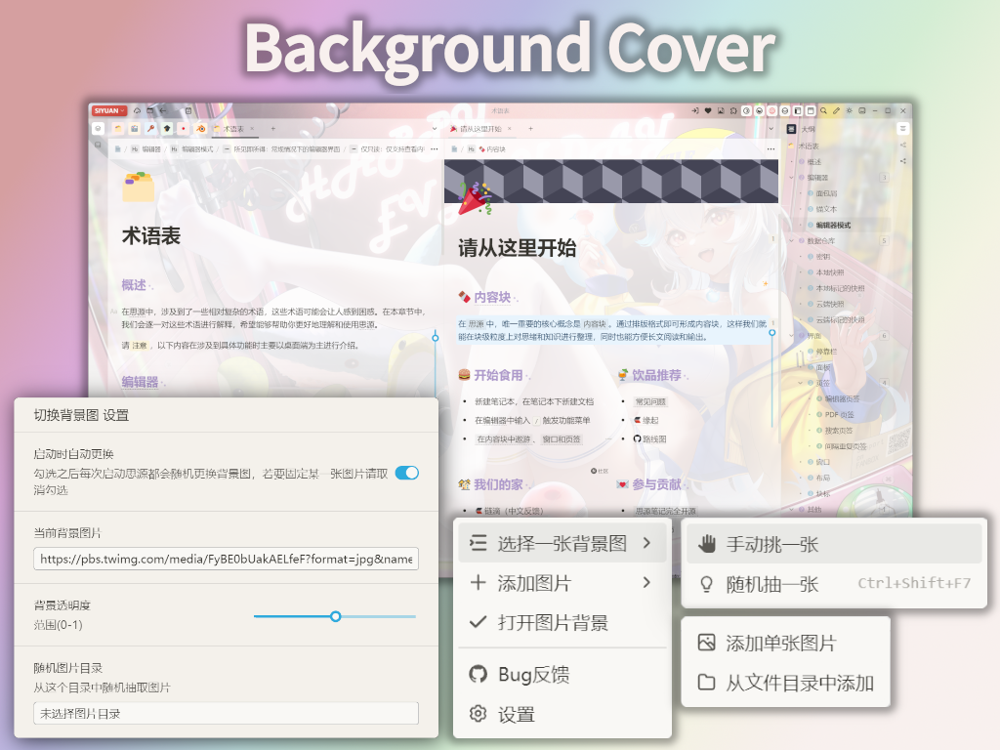

<h1 align="center">
   
    
   
  SiYuan - Background Cover
   
   
</h1>

添加一张你喜欢的图片铺满整个思源笔记
 
Add a picture you like to cover the entire Siyuan Note
 

## 预览 | Preview

## 特性 | Features

- [x] 目前仅支持**桌面端**以及**浏览器端** / Only the **desktop** and **browser-desktop** are supported.
- [ ] 平铺一张图片作为思源笔记背景 / Tiling a picture as a background for SiYuan Notes
- [ ] 手动设置图库的文件夹 / Manually specify the folder as image library
- [ ] 每次启动时随机选择图片 / Launching by choosing a random image

## 实现思路 | Implementation

* 添加背景图片的实现

  获取`<body>`标签，在其`style`属性中添加`background-image`值，但此时背景会被笔记的各个面板挡住，需要改变透明度来让图片透出来。

* 改变透明度的实现

  直接设置`<body>`标签的`opacity`属性并不可行，因为这样会把文字也加上透明度(整体透明)，不方便阅读，仅需要背景的透明度发生变化。

  为了保证不会大幅改变当前主题的原始配色表现，此插件仅在原本RGB色值基础上，添加alpha值。当主题的元素配色存在alpha值时，修改为用户定义的透明度。

  此插件按照上述原则，修改了思源笔记面板的工具条(`id='toolbar'`)，左右底侧菜单栏(`id="dockLeft"`, `id="dockRight"`, `id="dockBottom"`)， 编辑器(`id="layouts"`), 状态栏(`id="status"`)这几个主要笔记面板的`style`属性，在其中添加`background-color (!important)`(rgba)和`background-blend-mode:lighten`来实现透明化。对于弹出的菜单(如设置菜单、搜索菜单等)，为了可读性，并没有做透明化。

## 更新日志 | ChangeLogs

<b>June 2023</b>

**v23.06.16**

- 思源笔记启动时加载测试 / Onload when starting SiYuan
- 图片替换以及透明度实现 / implement the image replacement and transparency 

**v23.06.14**

- 初始化项目 / initialize the project

## 致谢 | Acknowledgement

此项目参考了 [vscode-background-cover](https://github.com/AShujiao/vscode-background-cover) 和 [思源dark+主题](https://github.com/Zuoqiu-Yingyi/siyuan-theme-dark-plus) 部分公开的代码    
This project is inspired and modified from [vscode-background-cover](https://github.com/AShujiao/vscode-background-cover) and [siyuan-theme-dark+](https://github.com/Zuoqiu-Yingyi/siyuan-theme-dark-plus)

封面背景图画师 / Background cover artist：    
`劉了了_Ale`  [爱发电AFDIAN](https://afdian.net/a/_LIAO) | [Fanbox](https://www.fanbox.cc/@ale) | [Bilibili](https://space.bilibili.com/3883010) | [Twitter](https://twitter.com/_LIAO)